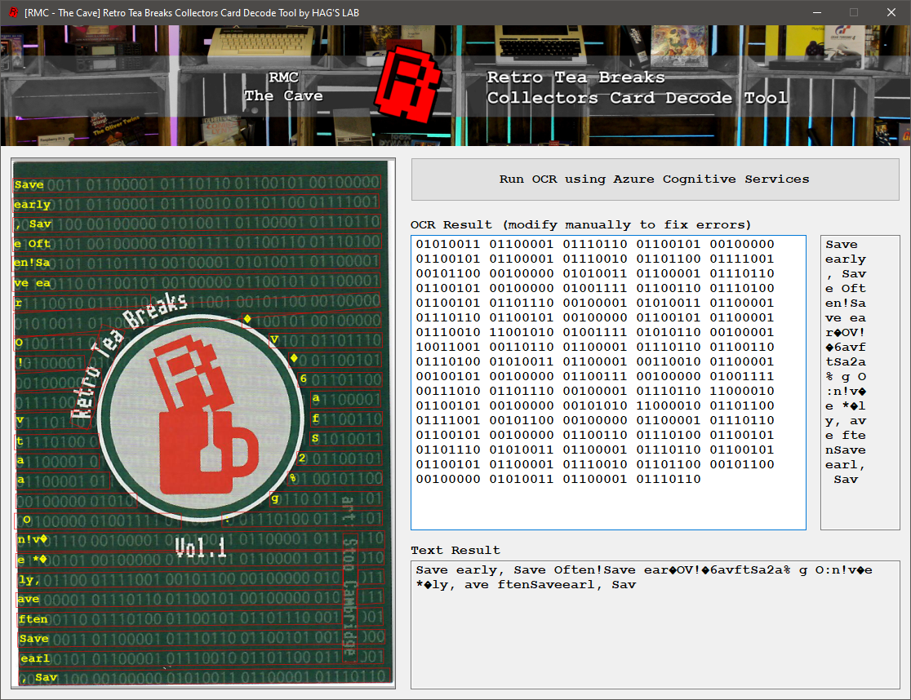
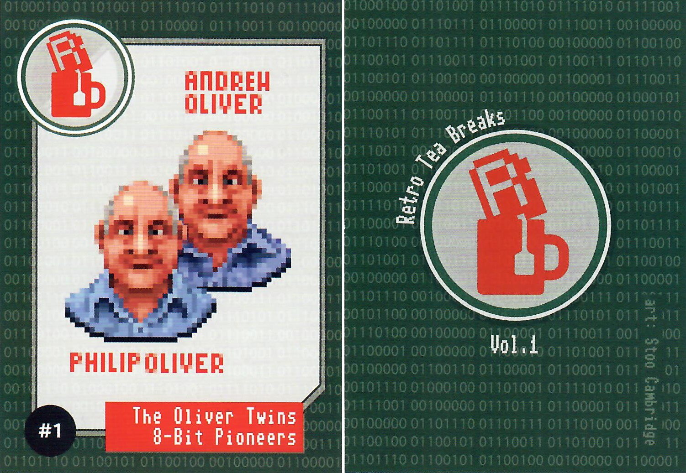

# Retro Tea Breaks Collectors Card Decode Tool

**A more or less useless (but somewhat cool) tool to decode, using Azure Cognitive Services, the binary text backgrounds on the Retro Tea Breaks collectors cards from the Retro Tea Breaks book by Neil Thomas. The collectors cards, drawn by Stoo Cambridge, were an extra perk for some of the Kickstarter awards.**

> ❗ An Azure Computer Vision Resource and its key and endpoint is needed to run this application. Create a Computer Vision Resource here: https://portal.azure.com/#create/Microsoft.CognitiveServicesComputerVision.

**Fig 1: Screenshot**

**Fig 2: Card Front & Back**

